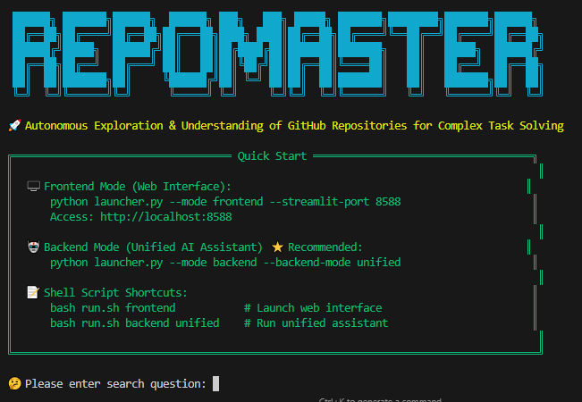

<div align="center">

  
  
  <p style="margin: 10px 0;">
    
    
    
  </p>

# RepoMaster: Autonomous Exploration and Understanding of GitHub Repositories for Complex Task Solving
  
  <p style="font-size: 15px; color: gray; margin-top: 4px;">
    🌐 <a href="README.md">English</a> | <a href="README_CN.md">中文</a>
  </p>

</div>

## 🚀 Overview

RepoMaster is a revolutionary autonomous agent framework specifically designed to explore, understand, and utilize GitHub repositories for solving complex real-world tasks. Unlike traditional approaches that generate code from scratch, RepoMaster treats open-source repositories on GitHub as composable tool modules, automatically leveraging these resources through intelligent search, hierarchical analysis, and autonomous exploration.

## 🚀 Framework

### 🎨 RepoMaster Framework Overview


### 🎯 Core Philosophy

- **Repositories as Tools**: Treat open-source repositories as pre-built toolkits
- **Human-like Exploration**: Mimic how programmers explore unfamiliar codebases
- **Smart Compression**: Efficiently manage code information within LLM context
- **Autonomous Execution**: End-to-end completion from understanding to execution

## 🎯 Quick Demo

Imagine describing a task in natural language, and RepoMaster automatically handles the rest: from finding the most suitable GitHub repository and understanding its complex code structure, to finally executing and completing the task! RepoMaster can handle everything from simple data extraction to complex AI model applications.

**Example Tasks**:
- **Simple**: "Help me scrape all product names and prices from this webpage."
- **Complex**: "Transform this portrait photo into the style of a Van Gogh oil painting."

### 🎨 Neural Style Transfer Demo

<table>
<tr>
<td align="center"><b>Original Image</b></td>
<td align="center"><b>Style Reference</b></td>
<td align="center"><b>Transfer Result</b></td>
</tr>
<tr>
<td></td>
<td></td>
<td></td>
</tr>
</table>

**Automated Workflow**:
1. 🔍 **Smart Search**: Find style transfer repositories on GitHub
2. 🏗️ **Structure Analysis**: Analyze code structure and pipelines
3. 🔧 **Autonomous Execution**: Configure environment and process images
4. ✅ **Task Completion**: Generate results without human intervention

### 🎬 Complete Execution Demo | [📺 YouTube Demo](https://www.youtube.com/watch?v=Kva2wVhBkDU)

<div align="center">

https://github.com/user-attachments/assets/a21b2f2e-a31c-4afd-953d-d143beef781a

*Complete process of RepoMaster autonomously executing neural style transfer task*

</div>

---

## 🚀 Quick Start

### 🛠️ Installation

**Prerequisites**:
```bash
python --version  # Python 3.11+ required
```

**Install Dependencies**:
```bash
git clone https://github.com/QuantaAlpha/RepoMaster.git
cd RepoMaster
pip install -r requirements.txt
```

**Configure API Keys**:
Create `configs/.env` file:
```bash
# Set the default API provider (openai, claude, deepseek, azure_openai)
# If not set, will use the first available provider in priority order
DEFAULT_API_PROVIDER=openai
# OpenAI Configuration
OPENAI_API_KEY=your_openai_key
OPENAI_MODEL=openai_model

# Claude Configuration  
ANTHROPIC_API_KEY=your_claude_key
ANTHROPIC_MODEL=claude_model

# DeepSeek Configuration
DEEPSEEK_API_KEY=your_deepseek_key
DEEPSEEK_MODEL=deepseek_model

# Google Gemini Configuration
GEMINI_API_KEY=
GEMINI_MODEL=gemini_model

# Web Search APIs (Required for deep search functionality)
Serper_API_KEY=your_serper_key          # For Google search results
JINA_API_KEY=your_jina_key              # For web content extraction
```

### 🚀 Run RepoMaster

**Frontend Mode (Web Interface)**:
```bash
python launcher.py --mode frontend
# Access: http://localhost:8501
```

**Backend Mode (Recommended)**:
```bash
python launcher.py --mode backend --backend-mode unified
```

**Shell Script Shortcuts**:
```bash
bash run.sh frontend      # Frontend mode
bash run.sh backend unified  # Backend unified mode
```

**For detailed configuration and advanced options, see our [User Guide](docs/user-guide.md).**

---

## 💻 Usage

### Frontend Mode
- 🌐 Interactive web chat interface
- 📁 File upload and management
- 👥 Multi-user session support
- 📊 Visual task progress tracking

### Backend Mode
**Unified Assistant** (Recommended):
```bash
python launcher.py --mode backend --backend-mode unified
```

**Specialized Modes**:
```bash
# Deep Search & Web Research
python launcher.py --mode backend --backend-mode deepsearch

# General Programming Assistant  
python launcher.py --mode backend --backend-mode general_assistant

# Repository-Specific Tasks
python launcher.py --mode backend --backend-mode repository_agent
```

### Programming Interface
```python
from core.agent_scheduler import RepoMasterAgent

task = "Transform this portrait into Van Gogh style using content.jpg and style.jpg"
result = repo_master.solve_task_with_repo(task)
```

**For advanced usage, configuration options, and troubleshooting, see our [Full Documentation](docs/).**

---

## 🤝 Contributing

We welcome contributions! Please see our [Contributing Guidelines](CONTRIBUTING.md).

### Development Setup
```bash
git clone https://github.com/your-org/RepoMaster.git
cd RepoMaster
pip install -e ".[dev]"
pre-commit install
```

---

## 📄 License

This project is licensed under the MIT License - see the [LICENSE](LICENSE) file for details.

---

## 📞 Support

- 📧 **Email**: quantaalpha.ai@gmail.com
- 🐛 **Issues**: [GitHub Issues](https://github.com/QuantaAlpha/RepoMaster/issues)
- 💬 **Discussions**: [GitHub Discussions](https://github.com/QuantaAlpha/RepoMaster/discussions)
- 📖 **Documentation**: [Full Documentation](docs/)

---

## 🙏 Acknowledgments

Special thanks to:
- [AutoGen](https://github.com/microsoft/autogen) - Multi-agent framework
- [OpenHands](https://github.com/All-Hands-AI/OpenHands) - Software engineering agents
- [SWE-Agent](https://github.com/princeton-nlp/SWE-agent) - GitHub issue resolution
- [MLE-Bench](https://github.com/openai/mle-bench) - ML engineering benchmarks

---

<div align="center">

**⭐ If RepoMaster helps you, please give us a star!**

Made with ❤️ by the QuantaAlpha Team

</div>
